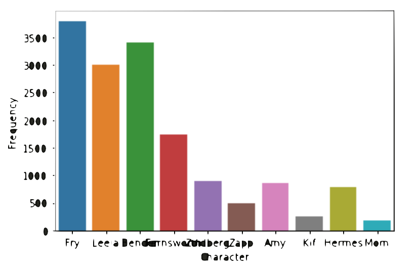
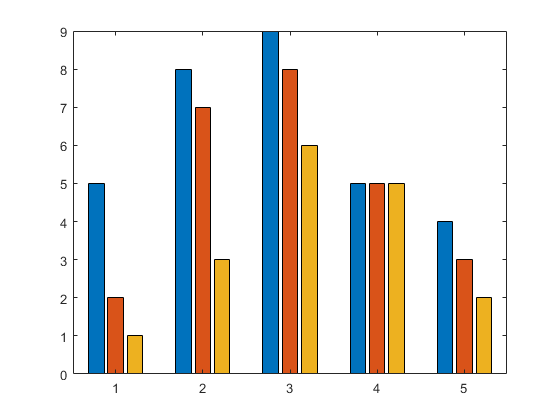

## Explaining the Data

I used a csv transcript of Futurama seasons one through six to analyze which character speaks the most and whether or not it differs by season. I hope to see if over the show’s run any character became dramatically more or less involved in the episodes. To start, I first used the data to make a new data frame depicting the character and the total number of lines they have. Since there are over a thousand characters represented in the data I narrowed by scope to just the ones with the top ten most amount of lines throughout the series. I used a bar plot to visualize the data. 

The plot showed more or less the outcome I expected. I then attempted to do the same but splitting each of these character’s total lines by the seasons they’re in. My plan was to make a three-variable clustered-column bar plot similar to this but with character name on the x-axis, number of lines on the y-axis and the colors to represent which season they come from.

Unfortunately I was unsuccessful in my attempt to turn my data (currently in the form of a dictionary) to a modelable data frame. Had I done so I would have a better visual to share.  

## Data Analysis 
For my final result, the variables I looked at were the top ten characters with the most lines and their number of lines per season. Across these ten, the mean, median and mode were as follows:

| | Season 1 | Season 2 | Season 3 | Season 4 | Season 5 | Season 6 | Total |
|:--:|:--:|:--:|:--:|:--:|:--:| :--:|:--:|
| Mean | | | | | | | 1540.1 |
| Medain | | | | | | | 882 |
| Mode | | | | | | | 3795, 3008, 3405, 1735, 898, 485, 866, 249, 779, 181 |

As evidenced by the pile of numbers, mode does not tell very much for this data. Mean however is interesting to take into account when considering the amount of lines in comparison to the total amount in that season. 

## Limitations 
The main limitation of this analysis is that it does not take into account the variation of line length. For example, although it would only count as one line, it is possible that there is an episode where there is just one character giving a monologue. Through this analysis, since it uses number of lines as opposed to line length, that 22 minutes of lines would be the same as a character responding “yep” to a question. Two ways to account for this limitation would be to judge characters by their word count as opposed to line count or to judge them based on the proportion of line or words per episode. 
	The other limitation I found with this data is that it often lists the same characters under various names due to typos and specificity (i.e. “Leela” also being written as “Leela (V.O.)”). While I attempted to clean up the data as much as possible, I’m sure there are still a few cases. 
  
## Conclusion
Unfortunately, since I was not able to complete my analysis, I cannot draw any meaningful conclusion at the time beyond that I do not understand python nearly as well as I thought I did. :(

